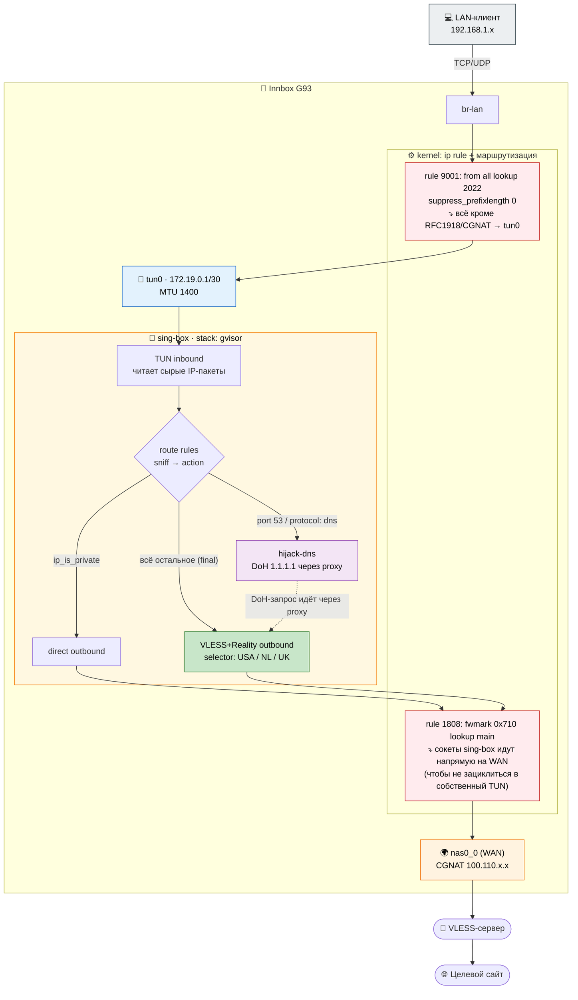
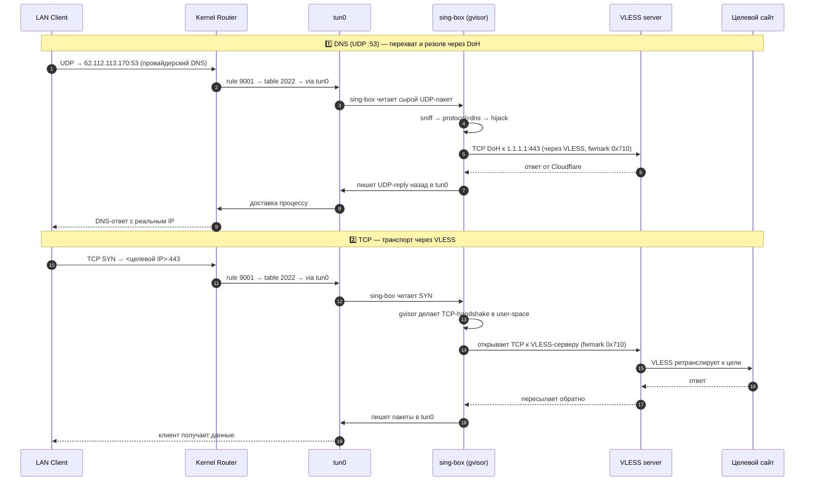

# innoboxG93_mgts_vpn

Прозрачный VPN на роутере **МГТС Innbox G93** через sing-box и VLESS+Reality.
Все устройства в вашей Wi-Fi сети автоматически идут через VPN, настраивать на
каждом телефоне/компе не надо.

> Если у вас дефолтный Innbox G93 от МТС и вы хотите, чтобы все устройства в
> домашней сети автоматически ходили через вашу VLESS-подписку — этот
> репозиторий делает это end-to-end. Клонируете, вписываете креды в JSON,
> запускаете одну команду, ждёте три минуты — готово.

---

## Оглавление

- [Зачем этот репозиторий](#зачем-этот-репозиторий)
- [Какие сюрпризы меня ждали](#какие-сюрпризы-меня-ждали)
- [Архитектура](#архитектура)
- [Как запустить с нуля](#как-запустить-с-нуля)
- [Управление после запуска](#управление-после-запуска)
- [Что лежит в репо](#что-лежит-в-репо)
- [Диагностика и траблшутинг](#диагностика-и-траблшутинг)
- [Справка по железу](#справка-по-железу)
- [Как оно работает под капотом](#как-оно-работает-под-капотом)
- [Лицензия](#лицензия)

---

## Зачем этот репозиторий

У меня дома стоит Innbox G93 от МГТС (GPON ONT + Wi-Fi). Я хотел, чтобы все
устройства — ноутбук, телефон, Steam Deck, умная розетка — ходили через мой
VLESS+Reality-сервер, и при этом не надо было настраивать VPN-клиенты на
каждом устройстве по отдельности. Идея банальная: развернуть sing-box
**на самом роутере** с transparent TUN-инбаундом, чтобы он перехватывал весь
трафик на уровне маршрутизации.

Готовых туториалов под это железо я не нашёл. Прошёл через несколько вечеров
отладки (ядерные правила маршрутизации, fw3 iptables, хитрый UBUS-ACL, тупиковые
попытки с армv7 бинарниками), прежде чем получить работающий конфиг. Решил
упаковать всё в репо, чтобы следующий человек, который купит/получит этот же
G93, не мучался, а за три минуты поднял себе всё то же самое.

Если у вас другой роутер — большая часть материала всё равно будет полезна:
идея `stack: gvisor` применима к любому sing-box TUN на слабом ARM-ядре, а
паттерн «`rc.local` + watchdog bash-loop» работает на любом OpenWrt с битым
кроном.

---

## Какие сюрпризы меня ждали

Это список вещей, на которые я потратил часы и которые не описаны нигде (или
описаны, но неочевидно):

### 1. У процессора **нет VFP/NEON**

`/proc/cpuinfo` показывает Cortex-A-класс, но колонки `features` не содержат
`vfp`/`neon`. Любой Go-бинарник, собранный под `armv7` с hard-float, падает на
первой же векторной операции. Нужен именно **armv5 soft-float** билд
sing-box. К счастью, sing-box его официально собирает:

```
sing-box-<версия>-linux-armv5.tar.gz
```

Если вы пробовали `linux-armv7` — вот почему он падал «без объяснений».

### 2. `"stack": "system"` молча дропает TCP

Это главное открытие, ради которого и затеян репозиторий. Ставишь в TUN-инбаунде
`stack: "system"` — TUN поднимается, `auto_route: true` и `strict_route: true`
корректно устанавливают правила `ip rule` и таблицу 2022, DNS-хайджек через
UDP/53 работает… и **TCP при этом просто не доходит до sing-box**. Логи
sing-box на уровне debug: ноль `inbound connection` (TCP), тонны
`inbound packet connection` (UDP). Пакеты теряются на уровне ядра/TUN-стека.

Фикс — поменять **ровно одну строчку**:

```json
"stack": "gvisor"
```

gVisor — это юзерспейсный сетевой стек, sing-box сам парсит TCP SYN и инициирует
исходящее соединение через VLESS. Медленнее чем `system`, но на этом ядре 5.4.55
+ этом железе — единственный вариант, который реально работает для TCP.

`sb_phase2.example.json` в репо уже с `gvisor`.

### 3. Крон на этой прошивке не работает

Демон `crond` запущен, `/etc/crontabs/root` редактируется, `/etc/init.d/cron reload`
возвращает 0, задачи пишутся корректно (`* * * * * touch /tmp/alive`), но
**ни одна не срабатывает**. Подозреваю seccomp/sandbox на demon'е в MGTS-сборке.

Единственный надёжный способ что-то делать по расписанию или держать фоновый
процесс — **bash-loop из `/etc/rc.local`**. Всё решение здесь — один большой
`rc.local`, который пишет себя из Python-скрипта через UBUS и ребутит роутер.
После ребута init запускает `rc.local`, тот форкает sing-box в бэкграунд плюс
watchdog-цикл, который висит всё время работы роутера.

### 4. UBUS ACL очень строгий

В этой прошивке нет SSH с LAN-стороны (dropbear биндится на management-VLAN
провайдера). Единственная точка управления снаружи — JSON-RPC на
`http://192.168.1.1/ubus/`. Логин `admin`/`admin` даёт уровень «poweruser»
(не root), с жёстким ACL:

- **`file.write`** — только белый список путей:
  - `/etc/rc.local`
  - `/etc/crontabs/root`
  - `/etc/luci-uploads/*` (любые файлы тут)
  - `/etc/dropbear/authorized_keys`
  - `/etc/firewall.user`
  - `/etc/opkg.conf`, `/etc/opkg/*.conf`
  - `/etc/sysupgrade.conf`
  - `/tmp/firmware.bin`, `/tmp/backup.tar.gz`, `/tmp/upload.ipk`, `/tmp/head_logo`

- **`file.exec`** — только белый список команд:
  - `/bin/cat`, `/bin/kill`, `/bin/ubus`, `/bin/umount`, `/bin/tar -tzf /tmp/backup.tar.gz`
  - `/bin/ping`, `/bin/ping6`, `/bin/traceroute`, `/bin/traceroute6`
  - `/sbin/ip -4 route show`, `/sbin/ip -4 neigh show` (и v6-аналоги)
    **но `ip rule show` не разрешён!**
  - `/sbin/ifup`, `/sbin/ifdown`, `/sbin/block`, `/sbin/uci`, `/sbin/wifi`
  - `/sbin/logread`, `/usr/sbin/logread`
  - `/sbin/sysupgrade -*`, `/sbin/reboot`
  - `/usr/sbin/iptables --line-numbers -w -nvxL -t * *` (только чтение)
  - `/usr/sbin/iptables -Z` (обнуление счётчиков)
  - `/usr/bin/ddns`, `/usr/bin/nslookup`
  - `/etc/init.d/cron reload`, `/etc/init.d/firewall restart`

- `iptables` через exec **только на чтение**. Модифицировать firewall можно
  только из `rc.local`, который выполняется init'ом как root без ACL.

Вывод: всё решение крутится через «написать правильный `rc.local` — ребутнуть —
читать результаты через `file.exec /bin/cat`».

### 5. Флэш памяти мизер

jffs2 overlay на `mtdblock15` — всего 8 МБ, свободно около 14-15 МБ с учётом
«тесного запаса». **Запись файла больше ~14 МБ через UBUS возвращает EAGAIN
(код 9)**. 56-мегабайтный sing-box в `/etc/` не засунуть никак — даже
19-мегабайтный tar.gz не влазит.

Поэтому решение: sing-box скачивается с GitHub **при каждой загрузке** во
временный `/tmp/singbox/` (это tmpfs в RAM — стирается на ребут). Добавляет
~2-3 минуты к времени старта, зато флэш не трогаем.

### 6. Таблица маршрутизации 2022 + эффект route_exclude_address

Когда `auto_route: true`, sing-box вместо одного маршрута `0.0.0.0/0 via tun0`
в таблице 2022 создаёт **префиксную развёртку** вида `0.0.0.0/5`, `8.0.0.0/7`,
`16.0.0.0/4` и т.д. — всё пространство IPv4 кроме исключённых диапазонов.
Это нужно, потому что правило `ip rule` имеет `suppress_prefixlength 0`,
которое подавляет только маршруты с префиксом 0 (default). Если не делать
префиксную развёртку, а ставить только default — он будет подавлен и пакет
уйдёт мимо TUN.

Если вы думаете «а зачем такая сложность, почему не `0.0.0.0/1` и `128.0.0.0/1`» —
потому что этот приём с /1-парой используется другими тулами (Wireguard, Tailscale),
а sing-box использует свою собственную схему. Знать это полезно когда смотришь
в `ip route show table 2022` и видишь 40 строк — всё нормально, это дизайн.

### 7. WAN у МТС-а это CGNAT

WAN-интерфейс `nas0_0` получает IP из `100.110.0.0/16` — это carrier-grade NAT
(RFC 6598). Внешний доступ к вашему роутеру снаружи невозможен, только выход.
Это значит, что SSH-сервер на роутере (даже если бы работал с LAN) недоступен
извне — только LAN. Весь репо рассчитан на управление **из LAN-сегмента
192.168.1.0/24**.

---

## Архитектура

### Общая схема потока трафика



### Как в реальности идёт TCP-соединение



### Что настраивается автоматически при старте

1. Подождать 20 секунд + проверить резолв DNS (`nslookup github.com`)
2. Если `/tmp/singbox/sing-box` не существует — скачать и распаковать
3. Запустить `sing-box run -c /tmp/singbox/config.json &`
4. Подождать до 40 секунд, пока `tun0` появится
5. Настроить `net.ipv4.conf.{all,tun0}.rp_filter = {2, 0}` (мягкий RPF)
6. Добавить iptables-правила в fw3:
   - `FORWARD -i br-lan -o tun0 -j ACCEPT`
   - `FORWARD -i tun0 -o br-lan -j ACCEPT`
   - `INPUT -i tun0 -j ACCEPT`
7. Запустить watchdog-петлю в бэкграунде

### Что делает watchdog

- Раз в 10 секунд проверяет, жив ли sing-box
- Если умер — рестарт, переприменение iptables/sysctl на случай если fw3
  сбросил их при relaod
- Счётчик неудачных рестартов. Если > 20 попыток подряд без стабильных
  60 секунд работы — backoff 5 минут (чтобы не захламлять лог при
  постоянном крэше)
- Ротация `/etc/luci-uploads/sb.log`: когда файл > 512 КБ — обрезать до
  последних 100 строк (иначе за сутки забил бы флэш)
- Слушает флаг-файлы `/etc/luci-uploads/SB_STOP` (разовый стоп) и
  `/etc/luci-uploads/SB_DISABLE` (не стартовать после ребута)

---

## Как запустить с нуля

### Что нужно иметь

1. **Роутер Innbox G93 от МГТС**, подключенный через PON, адрес по умолчанию
   192.168.1.1, логин admin/admin (дефолтный).
2. **Компьютер в LAN этого роутера** с установленным Python 3.
3. **VLESS+Reality подписка**. От любого провайдера, у которого сервера
   поддерживают Reality. Вам понадобятся для каждого сервера:
   - `host` и `port`
   - `uuid` (обычно один на всю подписку)
   - `flow` (обычно `xtls-rprx-vision`)
   - `public_key` (pbk) и `short_id` (sid) для Reality
   - `sni` (обычно совпадает с host)

### Шаг 1. Склонировать репо и подставить свои креды

```bash
git clone https://github.com/MaxSnuslove/innoboxG93_mgts_vpn.git
cd innoboxG93_mgts_vpn
cp sb_phase2.example.json sb_phase2.json
```

Откройте `sb_phase2.json` в любом редакторе и замените все `REPLACE_WITH_*` на
реальные значения вашей подписки. Файл `sb_phase2.json` в `.gitignore`, так
что он не попадёт случайно в git при ваших дальнейших коммитах.

В шаблоне три аутбаунда — USA, NL, UK — и селектор, по умолчанию выбирающий
USA. Если у вас другое количество серверов — отредактируйте список outbounds
и массив `outbounds` в селекторе.

### Шаг 2. Запустить деплой

```bash
python deploy_prod.py
```

Что произойдёт:
1. Скрипт залогинится в UBUS на 192.168.1.1 (admin/admin).
2. Соберёт ваш `sb_phase2.json` в base64 и вставит прямо в тело
   `rc.local`-а.
3. Запишет `rc.local` на роутер.
4. Запросит `system reboot` через UBUS.

После этого роутер уйдёт в ребут и за ~3-4 минуты поднимется с уже
работающим VPN. Включая:
- 30-60 секунд само-включение
- 20 секунд `sleep 20` в rc.local (ждём WAN)
- 30-120 секунд скачивание sing-box с GitHub (первые попытки через TLS часто
  падают, скрипт ретраит до 8 раз — обычно получается со 2-й)
- 15 секунд старт sing-box и появление tun0
- 5-10 секунд VLESS-хендшейк

### Шаг 3. Проверить что всё работает

```bash
python sb_control.py status
```

Должно быть:
```
sing-box processes: 1
  PID=XXXX CMD=/tmp/singbox/sing-box run -c /tmp/singbox/config.json
  /etc/luci-uploads/SB_STOP: absent
  /etc/luci-uploads/SB_DISABLE: absent
router uptime: XXXXs, free mem: XXXMb, load: [...]
```

Если `sing-box processes: 0` — либо ещё качается (смотрите `run log`), либо
упал:

```bash
python sb_control.py run     # лог rc.local / watchdog
python sb_control.py log 80  # хвост sing-box debug
```

В логе sing-box должны быть строки вида:
```
inbound connection from 192.168.1.144:55124 to 35.186.241.51:443
outbound/vless[vless-usa]: outbound connection to 35.186.241.51:443
connection upload finished
```

Это значит реально пошёл трафик через VLESS.

### Шаг 4. Проверить с клиента

Откройте на любом устройстве в LAN браузер и зайдите на:
- https://api.ipify.org — покажет внешний IP, **должен совпадать с IP вашего
  VLESS-выхода**, не с IP вашего WAN.
- https://2ip.ru — покажет страну (например, США).

---

## Управление после запуска

```bash
# Что крутится сейчас + уптайм роутера + память
python sb_control.py status

# Хвост sing-box лога. Работает пока лог меньше ~200 КБ (ограничение UBUS exec output).
# Если больше — смотрите через run или подождите ротации
python sb_control.py log 80

# Лог rc.local и watchdog'а (короткий, всегда читается)
python sb_control.py run

# Остановить текущий инстанс (watchdog среагирует за ~10 секунд).
# При следующей загрузке снова поднимется автоматически.
python sb_control.py stop

# Полностью выключить. Создаст флаг /etc/luci-uploads/SB_DISABLE —
# rc.local будет его проверять и при наличии ничего не запускать.
python sb_control.py disable

# Снять флаг — при следующем ребуте снова стартанёт
python sb_control.py enable
```

### Аварийный откат

Если что-то пошло не так — роутер странно ведёт себя, LAN-клиенты не
выходят в интернет, нужна чистая среда:

```bash
python rollback.py
```

Что сделает:
1. Залогинится в UBUS.
2. Перезапишет `/etc/rc.local` на минимальный безопасный вариант
   (только `uci set wireless.mesh.status=init`, больше ничего).
3. Очистит `/etc/crontabs/root`.
4. Убьёт все живые процессы sing-box и watchdog через `/bin/kill -9`.
5. Удалит флаги `SB_STOP` и `SB_DISABLE`.
6. Ребутнёт роутер.

Через ~90 секунд роутер поднимется в полностью чистом состоянии, как будто
ничего и не было.

---

## Что лежит в репо

| Файл | Что делает |
|------|------------|
| `deploy_prod.py` | Основной деплой. Читает `sb_phase2.json`, собирает rc.local, пишет через UBUS, ребутит. |
| `sb_control.py`  | Управление в рантайме (stop/disable/enable/status/log/run). |
| `rollback.py`    | Аварийный откат: чистый rc.local, убить sing-box, ребут. |
| `sb_phase2.example.json` | Шаблон конфига. Копируете в `sb_phase2.json`, вписываете креды. |
| `.gitignore`     | Исключает секреты, бинарники и dev-скрипты из git. |
| `LICENSE`        | MIT. |

---

## Диагностика и траблшутинг

### В `sb.log` видны UDP-события, но ни одного TCP

Вы на `stack: "system"`. Поменяйте в `sb_phase2.json` на `"stack": "gvisor"` и
перезапустите (`deploy_prod.py`). Это **главная ловушка** на этом железе.

### wget с самого роутера не работает, но клиенты в LAN работают

Зависит от `strict_route`. При `true` (текущий дефолт в шаблоне) трафик
самого роутера тоже должен идти через TUN. При `false` — не идёт (правило
`not iif lo lookup 2022` пропускает пакеты с iif=lo).

В любом случае, wget с роутера — **плохой индикатор здоровья VPN**, потому
что зависит от subtleties routing+iptables для lo-originated трафика. Тестируйте
**с LAN-устройства** — откройте https://api.ipify.org в браузере на ноуте.

### `dnsmasq` или `odhcpd` в логах пишут "Network is unreachable"

Обычно это происходит сразу после того как sing-box умер: route cache в
ядре ещё держит ссылку на исчезнувший tun0, пока не истёк. Watchdog должен
поднять sing-box за 10 секунд, после чего всё самоочистится. Если нет —
`python rollback.py`.

### Скачивание sing-box с GitHub фейлится на первой попытке (881 КБ)

Известная проблема с `release-assets.githubusercontent.com` — TLS-handshake
иногда прерывается на этапе получения сертификата, wget скачивает только
начало (header) и завершается как «успех». В `rc.local` стоит цикл из 8
попыток с проверкой, что файл ≥ 10 МБ. Обычно получается со 2-3 попытки.
Если **все 8** попыток провалились — у вас проблемы с маршрутом до github
или DNS не резолвит github.com.

### `ip rule show` через UBUS возвращает EACCES

ACL разрешает только `ip route show` и `ip neigh show`. `ip rule show` —
не разрешён, и никак обойти нельзя. Единственный способ увидеть правила —
выполнить `ip rule` изнутри `rc.local` (там root без ACL) и записать вывод
в `/etc/luci-uploads/phase2_run.log`, потом читать его через UBUS.

### `python sb_control.py log N` возвращает ничего

Значит лог > ~200 КБ и UBUS `file.exec` режет вывод. Подождите, пока watchdog
ротирует (при размере > 512 КБ — обрезает до последних 100 строк). Или
используйте `run` — этот лог всегда маленький.

### Роутер поднялся, но интернета на клиентах нет

Причин может быть несколько:
1. **sing-box ещё не запустился** — проверьте `sb_control.py run`, там
   должна быть строчка `[sb] watchdog pid=...`. Если нет — ещё идёт boot.
2. **sing-box упал при старте** — в `run` будет `[sb] FATAL: config invalid`
   или `[sb] NO BINARY`. Проверьте креды в `sb_phase2.json` или попробуйте
   пересобрать `deploy_prod.py` заново.
3. **VLESS-сервер недоступен** — проверьте через Phase 1 (SOCKS-only):
   в браузере настройте прокси `127.0.0.1:1080`, зайдите на сайт. Если не
   работает и через SOCKS — проблема с самим VLESS, а не с TUN.
4. **Неправильный UUID/pbk/sid** — sing-box стартанёт, но хендшейк будет
   падать с «reality verify failed». Смотрите `sb_control.py log 50`.

### Я хочу добавить правило «сайт X всегда через direct»

Отредактируйте `sb_phase2.json`, добавьте в `route.rules` перед `final`:

```json
{"domain_suffix": ["yandex.ru", "vk.com"], "action": "route", "outbound": "direct"}
```

Или по IP:
```json
{"ip_cidr": ["5.255.255.0/24"], "action": "route", "outbound": "direct"}
```

Или geoip (требует загрузки geoip database, sing-box поддерживает):
```json
{"rule_set": ["geoip-ru"], "action": "route", "outbound": "direct"}
```

После правки запустите `deploy_prod.py` заново.

---

## Справка по железу

| | |
|---|---|
| Модель | Innbox G93 (МГТС-бранд ZyXEL/Sagemcom/Innbox GPON ONT) |
| SoC | Airoha EN7523 (EcoNet), ARMv7 dual-core Cortex-A-class (**без VFP/NEON**) |
| ОС | Кастомная OpenWrt 2.0.0534 (LuCI + fw3 iptables legacy) |
| Ядро | Linux 5.4.55 |
| RAM | 480 МБ (реально свободно ~200 МБ после всех демонов) |
| Flash | ~8 МБ jffs2 overlay (/overlay) + 105 МБ LxC-партиция (mtdblock16) |
| LAN | `br-lan` 192.168.1.1/24 |
| WAN | `nas0_0` (GPON PPPoE/IPoE) — CGNAT 100.110.x.x |
| Wi-Fi | 2.4 ГГц + 5 ГГц, Mesh-capable |
| Админка | `http://192.168.1.1/cgi-bin/luci/` admin/admin (по умолчанию) |
| UBUS | `http://192.168.1.1/ubus/` JSON-RPC (с session.login) |
| Telephony | VoIP/SIP для МГТС-телефонии, TR-069 менеджмент к МТС-ACS |

### Раскладка флэш-памяти

```
mtd0   bootloader           (512 КБ)
mtd1   romfile              калибровка, MAC, серийник (256 КБ)
mtd2   kernel               основная банка (~4.6 МБ)
mtd3   rootfs               основная банка (~19 МБ)
mtd4   tclinux              комбо kernel+rootfs, основная (48 МБ)
mtd5   kernel_slave         зеркало для OTA-upgrade
mtd6   rootfs_slave         
mtd7   tclinux_slave        
mtd8   config               UCI config (1 МБ)
mtd9   Equip                (1 МБ)
mtd10  WlanE2pData          калибровка Wi-Fi (1 МБ)
mtd11  bootEnv              u-boot env (1 МБ)
mtd12  VoiceLog             логи телефонии
mtd13  SystemLog            
mtd14  SaaS                 МГТС feature-on-demand, jffs2 (2 МБ)
mtd15  rootfs_data          OVERLAY здесь, jffs2 (8 МБ)
mtd16  LxC                  Linux-контейнеры для МГТС-приложений (105 МБ)
mtd17  KernelLog            
mtd18  art                  (1.5 МБ)
```

Всего 168 МБ. Основные наблюдения:
- Писать можно только в `/overlay` = mtd15, максимум ~14 МБ за раз
- **mtd16 (105 МБ)** — это LxC-контейнерная партиция для МГТС-приложений
  (они туда что-то загружают по TR-069 при необходимости). Мы её не
  трогаем, но это потенциально большое место если когда-нибудь понадобится

### Список ubus-объектов

```
at-mngr          dhcp            dnsmasq         fad
file             hotplug.*       iwinfo          ledctrl
log              luci            luci-rpc        luci.*
mesh_node        network         network.*       ntsd
odu5g            parentctl       rc              sehd
service          session         statd           system
tr069            uci
```

Интересные: `tr069` (менеджмент МТС-ом), `odu5g` (видимо какой-то 5G ODU
радио, не уверен что подключено), `fad` (fast acceleration daemon —
hardware-offload GPON-трафика). Мы их не трогаем.

---

## Как оно работает под капотом

### Что делает sing-box `auto_route: true` на Linux

При старте TUN-инбаунда sing-box автоматически:

1. Создаёт интерфейс `tun0` с адресом `172.19.0.1/30` (из конфига `address`).
2. Добавляет таблицу маршрутизации 2022 с префиксной разбивкой всего IPv4
   пространства на части, **кроме** диапазонов, указанных в
   `route_exclude_address`. У нас исключены: 192.168/16, 10/8, 172.16/12,
   100.64/10 — то есть весь RFC1918 и CGNAT.
3. Создаёт правила `ip rule`:
   - `1808: fwmark 0x710 lookup main` — пакеты с fwmark=0x710 идут по
     обычному main (WAN default). Sing-box помечает собственные исходящие
     сокеты этим fwmark, чтобы они не попадали обратно в TUN (рекурсия).
   - `9000: to 172.19.0.0/30 lookup 2022` — пакеты *в* tun-подсеть идут
     в таблицу 2022 (там ссылаются на сам tun0).
   - `9001: from all lookup 2022 suppress_prefixlength 0` — **главное**
     правило. Вся маршрутизация идёт через таблицу 2022, кроме default
     (prefixlength 0). Эффективно: всё что покрыто в 2022 — туда.
   - `9002: not dport 53 lookup main suppress_prefixlength 0` — не-DNS
     пакеты пытаются найти маршрут в main (но без default). Это для
     трафика на адреса, которые в 2022 не покрыты.
   - `9003` (strict_route добавляет несколько вариантов): `not iif lo lookup 2022`,
     `from 0.0.0.0 iif lo lookup 2022`, `from 172.19.0.0/30 iif lo lookup 2022` —
     форсит трафик с роутера самого (iif=lo) тоже через TUN.
4. Открывает `/dev/net/tun` для чтения входящих пакетов.

### Что делает `strict_route: true`

Без него правило с `iif lo` пропускает трафик роутера самого мимо TUN —
он идёт через WAN default. С ним — добавляются специальные правила,
которые форсят даже `iif=lo` трафик через TUN. Это важно, если вы хотите,
чтобы `wget` с самого роутера (или, например, встроенный NTP-клиент) тоже
ходили через VPN.

**Но это же и усложняет отладку**: если VPN сломается, то даже
`nslookup github.com` с роутера не работает. Поэтому `deploy_prod.py` сначала
скачивает sing-box (пока правила TUN ещё не применены — потому что он ещё не
запущен), и только потом запускает. Тогда даже при сломанном TUN сам бинарник
уже есть.

### Откуда берётся fwmark 0x710

В OpenWrt / fw3 на этом роутере в `iptables -t mangle OUTPUT` уже есть:
```
CWMP_REMARK: mark set 0x710 for dst 62.112.97.59  (TR-069 ACS-сервер МТС)
```

То есть МТС-овский firmware **уже** использует 0x710 для своего TR-069
менеджмент-трафика, чтобы обходить VPN-правила (если бы они были).
Sing-box тоже использует 0x710 — совпадение, но не проблема: наше правило
`1808 lookup main` применяется к обоим и отправляет их по умолчанию через
WAN, что и нужно.

### Почему DNS специальный случай

В конфиге есть route-rule:
```json
{"protocol": "dns", "action": "hijack-dns"},
{"port": [53], "action": "hijack-dns"}
```

`hijack-dns` говорит sing-box: «не передавай этот DNS-пакет как есть на
outbound, а обработай через встроенный DNS-клиент согласно `dns.servers`».
У нас два сервера: `local` (udp 223.5.5.5) и `remote` (DoH через 1.1.1.1,
с `detour: "proxy"` — то есть сама DoH-сессия идёт через VLESS).
`final: "remote"` значит все неопределённые запросы идут через remote
(через VPN).

Зачем: провайдерский DNS может отдавать разные ответы в зависимости от
клиента (CDN-оптимизация, провайдерская фильтрация). Через собственный
DoH-резолвер по VPN получаете честный ответ от 1.1.1.1 напрямую.

---

## Благодарности

Открытие про `stack: gvisor` vs `stack: system` TCP-не-работает-но-UDP-работает
сделано в процессе отладки совместно с Claude (Anthropic) на конкретном этом
железе, 15 апреля 2026. Шеру в надежде что следующему человеку, у которого
тот же роутер, не придётся тратить день на выяснение того же самого.

---

## Лицензия

MIT. См. [LICENSE](LICENSE).
